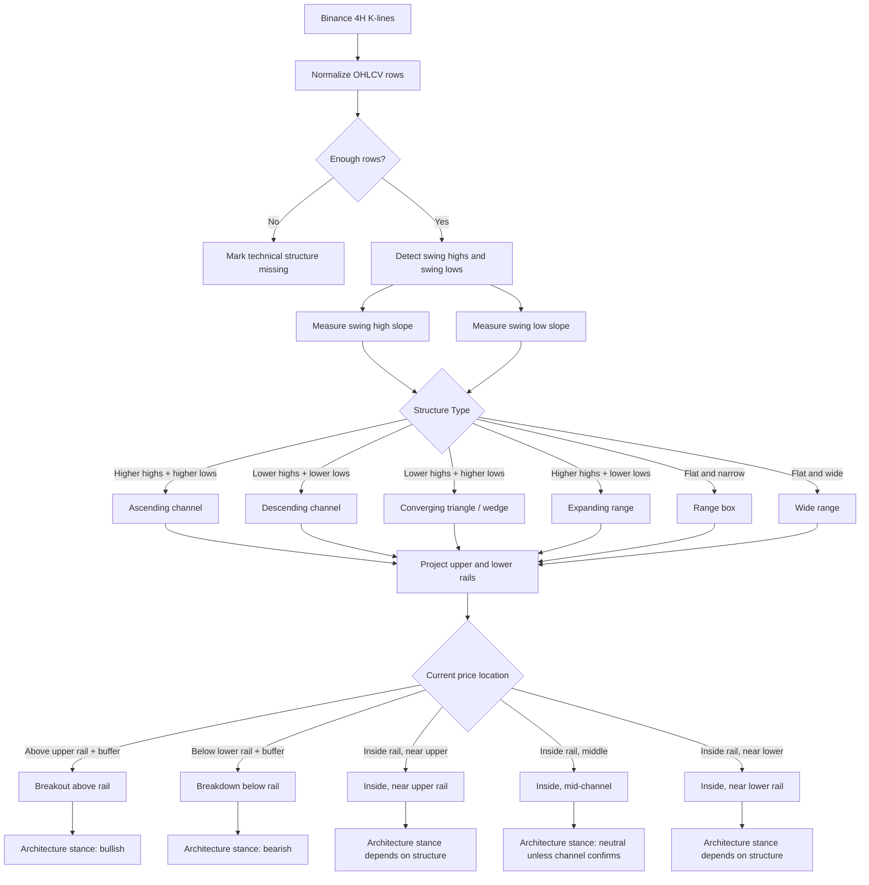
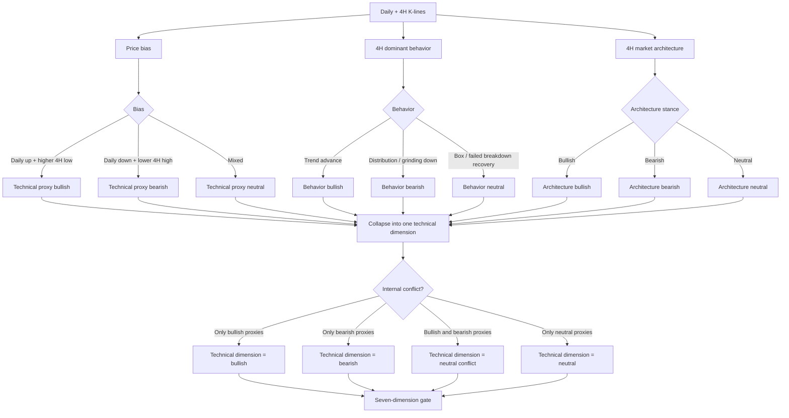

# Technical Architecture Logic

This document shows how the crypto technical structure layer converts K-line data into a single technical dimension vote.

## Crypto 4H Market Structure

## Technical Dimension Vote

## Decision Boundary

The market architecture layer is a technical proxy only. It can influence the technical structure dimension, but it cannot override contracts, macro, sentiment, exchange validation, news, options, or the CZSC confirmation layer.

For example:

- `Ascending channel + price inside upper half` can support the technical dimension.
- `Descending channel + price near upper rail` is not automatically bullish; it is usually a resistance test unless price breaks and holds above the rail.
- `Breakout above upper rail` is bullish only as a technical proxy; it still needs the direction quality gate to pass.
- `Expanding range` usually means unstable structure and should tend neutral unless a clean breakout or breakdown is confirmed.
